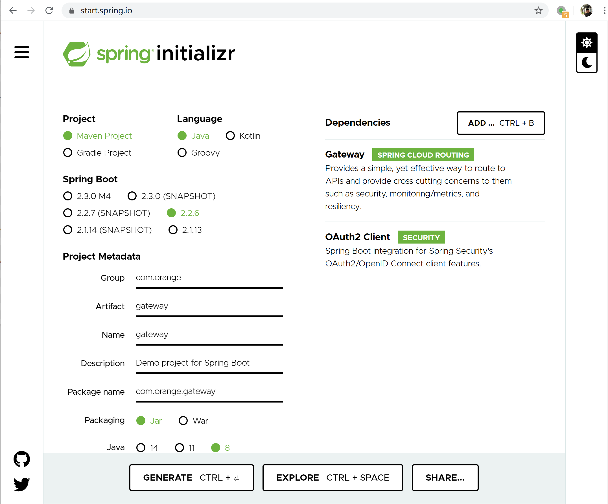
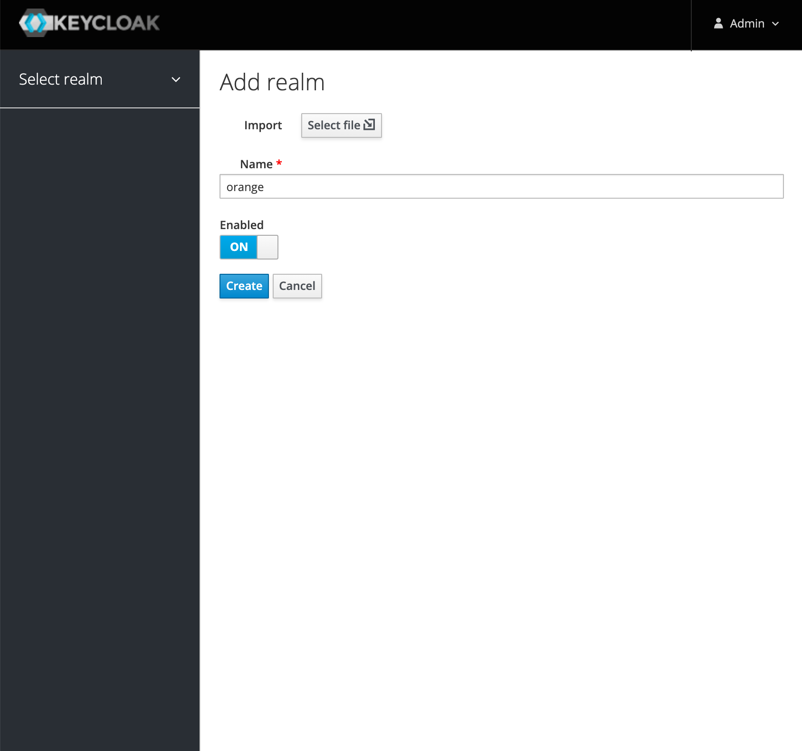
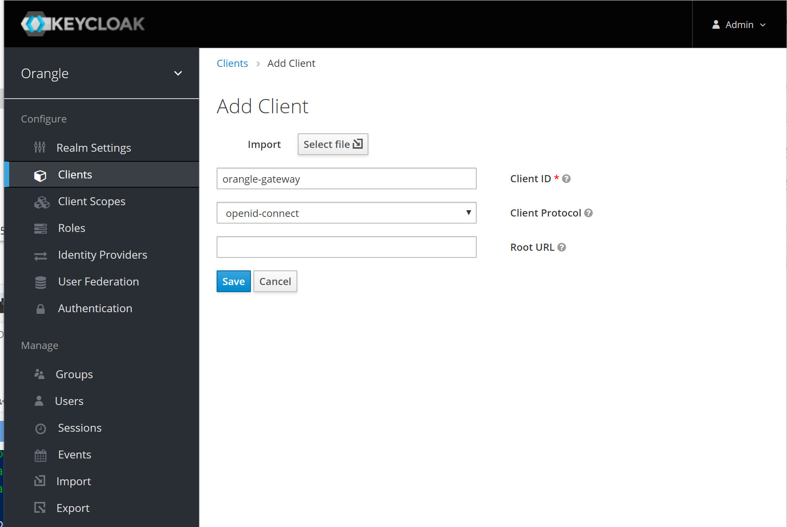
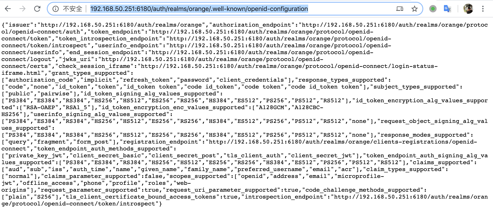
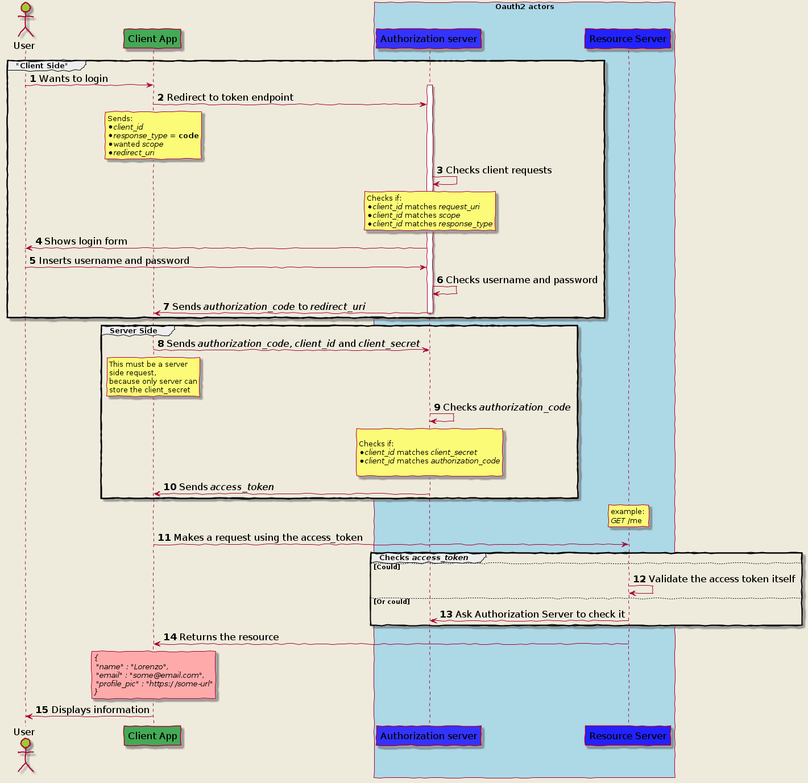

title: 如何使用Spring Gateway和KeyCloak构建一个OAuth2系统
date: 2020-04-22
 13:31:26
---

这篇文章介绍一下，如何搭建一个基于 Spring Gateway 和 KeyCloak 的 OAuth2 资源保护系统，这里只介绍思路和核心代码，供有一定基础的读者分享思路

首先我们需要了解这个小系统需要的组件，分别是
- **OAuth2 Server，这个我们选用的是 KeyCloak**
- **Api Gateway & OAuth2 Client，使用 Spring Gateway 作为 OAuth2 的客户端**
- **Resource Server (RS)，就是在 Api Gateway 后面隐藏的资源服务**

整体的架构可以看下图


> 图片出自 https://spring.io/blog/2019/08/16/securing-services-with-spring-cloud-gateway

认证流程是，客户端（浏览器）访问应用，此时没有认证状态，然后重定向到单点登录平台，也就是 KeyCloak，然后在 KeyCloak 上进行用户名密码认证(OIDC)，成功后，KeyCloak 返回认证后的信息，然后客户端（Gateway）通过这些信息，再生成一个 Token，传到被保护的 Resource Resource Server 拿到这个 Token 再向 KeyCloak 进行权限的认证，如果认证都通过，则允许对资源进行操作。

## OIDC
我们会使用 `OIDC` 作为用户登录认证

### 什么是 OIDC

看一下官方的介绍（http://openid.net/connect/）
> OpenID Connect 1.0 is a simple identity layer on top of the OAuth 2.0 protocol. It allows Clients to verify the identity of the End-User based on the authentication performed by an Authorization Server, as well as to obtain basic profile information about the End-User in an interoperable and REST-like manner.
>
> OpenID Connect allows clients of all types, including Web-based, mobile, and JavaScript clients, to request and receive information about authenticated sessions and end-users. The specification suite is extensible, allowing participants to use optional features such as encryption of identity data, discovery of OpenID Providers, and session management, when it makes sense for them.

简单的来说，就是在 OAuth2 上多做了一个身份层，是一个基于 OAuth2 协议的身份认证标准协议。OIDC 使用 OAuth2 的授权服务器来为第三方客户端提供用户的身份认证，并把对应的身份认证信息传递给客户端，且可以适用于各种类型的客户端（比如服务端应用，移动APP，前端 SPA ），且完全兼容 OAuth2。

所以，我们只需要使用 Spring Security 的 OAuth2 模块进行配置即可

# Api Gateway 搭建

第一步我们可以先进行 Api Gateway 的搭建，然后再回过头来设置 KeyCloak

我们假设这个 Demo 应用的名字为 orange

然后我们要搭建 api gateway，使用 https://start.spring.io 来生成项目，十分方便



我们勾选了 Gateway 和 OAuth2 Client 这两个依赖，然后下载下来，在 IDE 中打开，尝试运行一下，成功的话应该会在 8080 端口运行。

# KeyCloak 搭建

搭建一个 KeyCloak demo 也是十分简单，可以直接从官方网站上下载 java 包，然后通过命令也是可以一键运行，不过这里还是推荐使用 Docker 来运行，十分方便和干净

这里给出 Docker KeyCloak 容器启动命名，我们把端口映射到 6180

``` bash
docker run -p 6180:8080 -e KEYCLOAK_USER=admin -e KEYCLOAK_PASSWORD=123456 -d jboss/keycloak
```

> 这个 Admin 密码设成 123456，在正式一点的环境肯定也是不行的，不过我们是 Demo，就不需要管那么多了

然后创建一个 `Realm`



然后创建一个客户端 Client




接着创建一个用户


最后，我们需要使用到 OpenID 的一些 URI，我们可以打开这个 URL 来查到全面的 URI，这些 URI 会 OAuth 客户端中用到

`http://192.168.50.251:6180/auth/realms/orange/.well-known/openid-configuration`

> 需要将我们的 ip 和 realm 名字替换成实际的




# 与 Gateway 集成

## 授权类型
然后我们需要在 Gateway 上集成 OAuth2，我们选择的授权类型是 `Authorization Code Grant`，虽然我们这个 Demo 的前端也是一个 SPA，可以直接用前端作为一个 OAuth2 客户端，然后选择 `Implicit Grant` 作为授权类型，但是我们还是选择了 `Authorization Code Grant`，这种授权类型的流程见下图



> 图片出自 [An OAuth 2.0 introduction for beginners](https://itnext.io/an-oauth-2-0-introduction-for-beginners-6e386b19f7a9)

为什么要选择 `Authorization Code Grant` 而不是 `Implicit Grant`，考虑的其实是一个安全性问题。

> 在使用隐式许可类型时需要对它严苛的局限性有所认识。首先，使用这种许可流程的客户端无法持有客户端密钥，因为无法对浏览器隐藏密钥。但由于这种许可流程只使用授权端点而不使用令牌端点，因此这个限制不会影响其功能，因为不要求客户端在授权端点上进行身份认证。然而，由于缺少对客户端进行身份认证的手段，确实会影响这种许可类型的安全等级，因此要谨慎使用。另外，隐式许可流程不可用于获取刷新令牌。因为浏览器内的应用具有短暂运行的特点，只会在被加载到浏览器的期间保持会话，所以刷新令牌在这里的作用非常有限。而且，和其他许可类型不同，这种许可类型会假设资源拥有者一直在场，必要时可以对客户端重新授权。在这种许可类型下，授权服务器仍然可以遵循首次使用时信任（TOFU）的原则，通过允许重新授权获得无缝的用户体验。
>
>贾斯廷·里彻,安东尼奥·桑索. OAuth 2实战 (Chinese Edition) (Kindle 位置 1940-1945). Kindle 版本. 


## Maven 依赖
``` xml
<dependency>
    <groupId>org.springframework.cloud</groupId>
    <artifactId>spring-cloud-starter-gateway</artifactId>
</dependency>
<dependency>
    <groupId>org.springframework.boot</groupId>
    <artifactId>spring-boot-starter-oauth2-client</artifactId>
</dependency>
<dependency>
    <groupId>org.springframework.security</groupId>
    <artifactId>spring-security-oauth2-client</artifactId>
</dependency>
```

## Application.yaml DSL 配置
然后现在 application.yaml 中配置 OAuth2，只需要在 Provider 下面的 KeyCloak 中配置 `issuer-uri` 即可，这个地址可以在 keycloak 的 Admin 中找到

``` yaml
spring:
  security:
    oauth2:
      client:
        provider:
          keycloak:
            issuer-uri: http://192.168.50.251:6180/auth/realms/humpback_dev
        registration:
          keycloak:
            client-id: orange
            client-secret: a1246398-4c2f-46bd-b83d-9b1313f3378d
```

然后我们继续通过 yaml 文件配置 gateway 的配置，其中 `http://localhost:8260` 是我们接下来要创建 RS 服务。

``` yaml
spring:
  cloud:
    gateway:
      routes:
        - id: orange
          uri: http://localhost:8260
          predicates:
            - Path=/**
          filters:
#            - TokenRelay
            - TokenRelayWithTokenRefresh
            - RemoveRequestHeader=Cookie, Set-Cookie
```
注意上面被注释掉的 `TokenRelay`，这是一个 GatewayFilterFactory，不过这个 Filter 现在还有个比较大的问题，就是如果 Access Token 过期的话，还是会把请求发到 RS 那里，导致后续请求都是 401 的状态。

这个问题可以看 https://github.com/spring-cloud/spring-cloud-security/issues/175 这个 Github Issue

这个 Issue 下面有一个现成的解决方案，就是自定义一个 TokenRelay，实现如下：

``` java
import java.time.Duration;

import org.springframework.cloud.gateway.filter.GatewayFilter;
import org.springframework.cloud.gateway.filter.factory.AbstractGatewayFilterFactory;
import org.springframework.security.core.Authentication;
import org.springframework.security.oauth2.client.OAuth2AuthorizeRequest;
import org.springframework.security.oauth2.client.OAuth2AuthorizedClient;
import org.springframework.security.oauth2.client.ReactiveOAuth2AuthorizedClientManager;
import org.springframework.security.oauth2.client.ReactiveOAuth2AuthorizedClientProvider;
import org.springframework.security.oauth2.client.ReactiveOAuth2AuthorizedClientProviderBuilder;
import org.springframework.security.oauth2.client.authentication.OAuth2AuthenticationToken;
import org.springframework.security.oauth2.client.registration.ReactiveClientRegistrationRepository;
import org.springframework.security.oauth2.client.web.DefaultReactiveOAuth2AuthorizedClientManager;
import org.springframework.security.oauth2.client.web.reactive.function.client.ServerOAuth2AuthorizedClientExchangeFilterFunction;
import org.springframework.security.oauth2.client.web.server.ServerOAuth2AuthorizedClientRepository;
import org.springframework.security.oauth2.core.OAuth2AccessToken;
import org.springframework.stereotype.Component;
import org.springframework.web.server.ServerWebExchange;

import reactor.core.publisher.Mono;

/**
 * Token Relay Gateway Filter with Token Refresh. This can be removed when issue {@see https://github.com/spring-cloud/spring-cloud-security/issues/175} is closed.
 * Implementierung in Anlehnung an {@link ServerOAuth2AuthorizedClientExchangeFilterFunction}
 */
@Component
public class TokenRelayWithTokenRefreshGatewayFilterFactory extends AbstractGatewayFilterFactory<Object> {

    private final ReactiveOAuth2AuthorizedClientManager authorizedClientManager;

    private static final Duration accessTokenExpiresSkew = Duration.ofSeconds(3);

    public TokenRelayWithTokenRefreshGatewayFilterFactory(ServerOAuth2AuthorizedClientRepository authorizedClientRepository,
                                                          ReactiveClientRegistrationRepository clientRegistrationRepository) {
        super(Object.class);
        this.authorizedClientManager = createDefaultAuthorizedClientManager(clientRegistrationRepository, authorizedClientRepository);
    }

    private static ReactiveOAuth2AuthorizedClientManager createDefaultAuthorizedClientManager(
            ReactiveClientRegistrationRepository clientRegistrationRepository,
            ServerOAuth2AuthorizedClientRepository authorizedClientRepository) {

        final ReactiveOAuth2AuthorizedClientProvider authorizedClientProvider =
                ReactiveOAuth2AuthorizedClientProviderBuilder.builder()
                        .authorizationCode()
                        .refreshToken(configurer -> configurer.clockSkew(accessTokenExpiresSkew))
                        .clientCredentials(configurer -> configurer.clockSkew(accessTokenExpiresSkew))
                        .password(configurer -> configurer.clockSkew(accessTokenExpiresSkew))
                        .build();
        final DefaultReactiveOAuth2AuthorizedClientManager authorizedClientManager = new DefaultReactiveOAuth2AuthorizedClientManager(
                clientRegistrationRepository, authorizedClientRepository);
        authorizedClientManager.setAuthorizedClientProvider(authorizedClientProvider);

        return authorizedClientManager;
    }

    public GatewayFilter apply() {
        return apply((Object) null);
    }

    @Override
    public GatewayFilter apply(Object config) {
        return (exchange, chain) -> exchange.getPrincipal()
                // .log("token-relay-filter")
                .filter(principal -> principal instanceof OAuth2AuthenticationToken)
                .cast(OAuth2AuthenticationToken.class)
                .flatMap(this::authorizeClient)
                .map(OAuth2AuthorizedClient::getAccessToken)
                .map(token -> withBearerAuth(exchange, token))
                // TODO: adjustable behavior if empty
                .defaultIfEmpty(exchange).flatMap(chain::filter);
    }

    private ServerWebExchange withBearerAuth(ServerWebExchange exchange, OAuth2AccessToken accessToken) {
        return exchange.mutate().request(r -> r.headers(headers -> headers.setBearerAuth(accessToken.getTokenValue()))).build();
    }

    private Mono<OAuth2AuthorizedClient> authorizeClient(OAuth2AuthenticationToken oAuth2AuthenticationToken) {
        final String clientRegistrationId = oAuth2AuthenticationToken.getAuthorizedClientRegistrationId();
        return Mono.defer(() -> authorizedClientManager.authorize(createOAuth2AuthorizeRequest(clientRegistrationId, oAuth2AuthenticationToken)));
    }

    private OAuth2AuthorizeRequest createOAuth2AuthorizeRequest(String clientRegistrationId, Authentication principal) {
        return OAuth2AuthorizeRequest.withClientRegistrationId(clientRegistrationId).principal(principal).build();
    }
}
```

## SecurityConfig
接下来就是 Spring Security 的设置了，具体可以看这个方法

这个是 WebFlux 的 Security 配置，跟 Spring MVC 的配置还是挺不一样的
``` java
@Bean
public SecurityWebFilterChain springSecurityFilterChain(ServerHttpSecurity http,
                                                        ReactiveClientRegistrationRepository clientRegistrationRepository) {
    http.cors();

    http.oauth2Login().authenticationSuccessHandler(myServerAuthenticationSuccessHandler);

    http.logout(logout -> logout.logoutSuccessHandler(
            new OidcClientInitiatedServerLogoutSuccessHandler(clientRegistrationRepository)));
    http.logout().logoutUrl("/auth/logout");

    http.authorizeExchange().anyExchange().authenticated();

    http.headers().frameOptions().disable().xssProtection().disable();
    http.csrf().disable();
    http.httpBasic().disable();
    http.formLogin().disable();
    return http.build();
}
```
这个配置先设置了 OAuth2，包括 login，logout 等，然后把一些安全保护方法都去掉，不然等会在前端调用会十分麻烦

> 当然在生产环境还是要老老实实配置好 csrf，xss 这些参数。

## 处理重定向问题
最后我们还有一个问题需要考虑

因为 orange 这个应用的 OAuth2 客户端是在 Gateway，前端也有多种方法可以构造授权 Url 到 KeyCloak 进行登陆授权，但是我们选择一种比较简单的方法，那就是在页面中直接重定向到我们的 Gateway

假设我们前端运行在 `http://localhost:3000` 这个域名端口下，然后我们打开了 `http://localhost:3000/orange_list` 这页面，在这个页面进行登陆授权

然后我们 redirect 重定向到我们的 gateway 地址 `http://localhost:8080`，因为我们并没有授权过的 session，所以 gateway 会构造 URL 到 KeyCloak 中授权，这个 URL 大概长这样 `http://192.168.50.251:6180/auth/realms/orange/protocol/openid-connect/auth?response_type=code&client_id=humpback-gateway&scope=openid%20address%20email%20microprofile-jwt%20offline_access%20phone%20profile%20roles%20user%20web-origins&state=VHp-YIiBsy9G-Kxm206bGHmm2gGRjF7D8Eu5rGpZVtM%3D&redirect_uri=http://localhost:8080/login/oauth2/code/keycloak&nonce=KzOiAXpzqrRXK67qzYdF5wK2pH_KGCUaBEHdz3pdnYI`

可以看到这个 URL 中的 redirect_url 指的是 gateway 地址，因为在 keycloak 授权完成之后，keycloak 重定向到 Gateway，URL长这样👇:

`http://192.168.50.251:6180/auth/realms/humpback_dev/protocol/openid-connect/auth?response_type=code&client_id=humpback-gateway&scope=openid%20address%20email%20microprofile-jwt%20offline_access%20phone%20profile%20roles%20user%20web-origins&state=54Hy3lHVo1l2AMGPUWRDvBQIoLru328qr3p-5ynpp20%3D&redirect_uri=http://localhost:8080/login/oauth2/code/keycloak&nonce=frqYBfSEjaScFuYLI3KF6TE1vNVwjht0minWWSbDzZ0`

然后 gateway 会再次请求 OAuth Server（也就是 KeyCloak）获取 Access Token

> 当然，如果 `Implicit Grant` 的话，就不需要这么麻烦，直接用前端作为 OAuth 客户端即可，也不需要 Server 端处理 OAuth 流程了

这个时候，作为登录这个用例来看，已经是登录成功了，那么 Gateway 就需要重定向回我们的前端页面了，不过这个时候 Gateway 并不知道之前来的 `http://localhost:3000/orange_list`


当然也是做到 redirect 回之前的页面的，但是十分麻烦，思路是前端重定向到 Gateway 的时候带上 redirect_url，例如 http://localhost:8080/oauth/keycloak?redirect_url=http://localhost:3000/orange_list ，然后把 `http://localhost:3000/orange_list` 保存到 Session 中，登录完成后从 session 中拿到 `http://localhost:3000/orange_list` 进行重定向

这种方法在 server 端带来了额外的状态，而且这个逻辑会跟正常的 API 请求有冲突，所以 gateway 索性把这个重定向功能还给前端，让前端通过 session storage 或者其他方法来处理

最后，登录成功之后，通过自定义的 `SuccessHandler` 重定向回前端页面，下面是 `ServerAuthenticationSuccessHandler` 的实现代码

``` java
@Component
public class MyServerAuthenticationSuccessHandler implements ServerAuthenticationSuccessHandler {
    private ServerRedirectStrategy redirectStrategy = new DefaultServerRedirectStrategy();

    @Value("${application.frontend_url}")
    private String DEFAULT_LOGIN_SUCCESS_URL; // http://localhost:3000

    @Override
    public Mono<Void> onAuthenticationSuccess(WebFilterExchange webFilterExchange, Authentication authentication) {
        URI url = URI.create(DEFAULT_LOGIN_SUCCESS_URL);
        return this.redirectStrategy
                .sendRedirect(webFilterExchange.getExchange(), url);
    }
}
```

# Resource Service 搭建
Resource Service 就是被保护的资源，当然也可以是其他类型的服务。

创建一个 kotlin 的 Orange data 类
``` kotlin
data class Orange(var name: String, var queryUserId: String) {}
```

实现简单的 RestController，同样也是 Kotlin 代码
``` kotlin
import org.springframework.http.MediaType
import org.springframework.security.core.annotation.AuthenticationPrincipal
import org.springframework.security.oauth2.jwt.Jwt
import org.springframework.web.bind.annotation.*

@RestController
class OrangeController() {
    @RequestMapping(value = ["/oranges"], method = [RequestMethod.GET], produces = [MediaType.APPLICATION_JSON_VALUE])
    fun querySpaces(@AuthenticationPrincipal() principal: Jwt): List<Orange> {
        val orange1 = Orange("Orange1", principal.claims.get("sub") as String)
        val orange2 = Orange("Orange2", principal.claims.get("sub") as String)
        return listOf(orange1, orange2)
    }
}
```


然后我们配置 Spring Security 的 resource server

我们需要用到 `spring-boot-starter-oauth2-resource-server` 这个包

``` xml
<dependency>
    <groupId>org.springframework.boot</groupId>
    <artifactId>spring-boot-starter-oauth2-resource-server</artifactId>
</dependency>
```

然后在 application.yaml 中进行配置 Jwt Resource Server

``` yaml
spring:
  security:
    oauth2:
      resourceserver:
        jwt:
          issuer-uri: http://[keycloak_host]/auth/realms/orange
          jwk-set-uri: http://[keycloak_host]/auth/realms/orange/protocol/openid-connect/certs
```

``` kotlin
@Configuration
class SecurityConfig : WebSecurityConfigurerAdapter() {

    @Throws(Exception::class)
    override fun configure(http: HttpSecurity) {
        // TODO: check role
        // https://stackoverflow.com/questions/47069345/how-to-use-spring-security-remotetokenservice-with-keycloak
        // https://github.com/spring-projects/spring-security/wiki/OAuth-2.0-Migration-Guide
        http
                .authorizeRequests()
                .antMatchers("/**")
                .hasAuthority("SCOPE_openid")
                // .antMatchers("/**")
                // .hasRole("USER")
                .anyRequest().authenticated()
                .and()
                .headers().frameOptions().disable().xssProtection().disable()
                .and()
                .formLogin().disable()
                .oauth2ResourceServer()
                .jwt()
    }
}
```

> 上面的代码中，还有一个问题还没有解决，就是 `hasRole` 这个方法一直不生效，也上网查阅过很多资料，包括在 keyCloak 中对 Role 进行 Mapping，但是还是不生效，在 Spring Security 的源码中看了一下，好像在 Web Reactive 的代码中没有找到 hasRole 的相关代码，也就暂时放下了，读者在参考这篇文章实现的时候要多注意一下。


最后我们在 Postman 中进行最后的测试，Get `http://localhost:8080/oranges` 来获取两个 Orange 资源

我们需要在 Postman 的 Authorization 选项卡中获取 OAuth2 的 Access Token，Spring Security 会自动 Decode 去再向 KeyCloak 获取一遍 Access Token，然后创建 Session

> 当然 Postman 的步骤比较麻烦，也可以直接通过浏览器打开 http://localhost:8080， 浏览器会重定向到 KeyCloak 进行认证，不过认证成功后会跳转到前端 http://localhost:3000，这时候再访问 http://localhost:8080/oranges 即可


可以看到我们已经获取到了两个 Orange JSON 对象
# 前端
前端的集成方案就比较简单，如果是服务端模版生成的前端，还是单页面 Javascript 应用程序，只要没有登录，就直接重定向到 gateway 的地址，然后 gateway 处理完 KeyCloak 的登录流程后，就会自动跳转回前端页面。

如前文所说，这种方案的 Url 重定向需要由前端来处理，假如你在 `http://localhost:3000/welcome` 页面，如果登录完之后，最好还是跳转回 `/welcome`，但是 Gateway 重定向到 `http://localhost:3000`

而判断用户是否已经登录，已经重定向到 Gateway 进行登录这一个动作也是前端页面完成的，那么可以在前端重定向之前，把当前的 Url 记录到 `SessionStorage` 中，然后从 Gateway 登录回来之后再读取 `SessionStorage` 中的内容，进行重定向。


# 一些总结
最后，总的来说，现在 Spring 的 WebFlux 技术栈虽然说已经发展挺久的，但是相对来说资料还是比较少，而且看上起问题还不少，特别是 WebFlux + Spring Security OAuth，所以没有特殊要求还是选择 Zuul 作为 Gateway 比较省心。

第二，如果后端对登录这一块没有更强的安全要求，或者对登录态有控制要求的话，前端可以直接使用 `Implicit Grant`来获取 Access Token，Gateway 就只需要做转发即可。


# 参考资料
- [Securing Services with Spring Cloud Gateway](https://spring.io/blog/2019/08/16/securing-services-with-spring-cloud-gateway)
- [An OAuth 2.0 introduction for beginners](https://itnext.io/an-oauth-2-0-introduction-for-beginners-6e386b19f7a9)
- [Spring Security 5 – OAuth2 Login](https://www.baeldung.com/spring-security-5-oauth2-login)
- [Spring Cloud Gateway with OpenID Connect and Token Relay](https://blog.jdriven.com/2019/11/spring-cloud-gateway-with-openid-connect-and-token-relay/)
- 《OAuth 2实战》