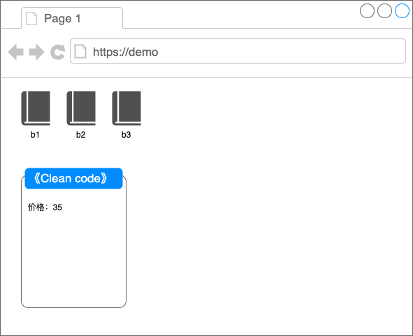
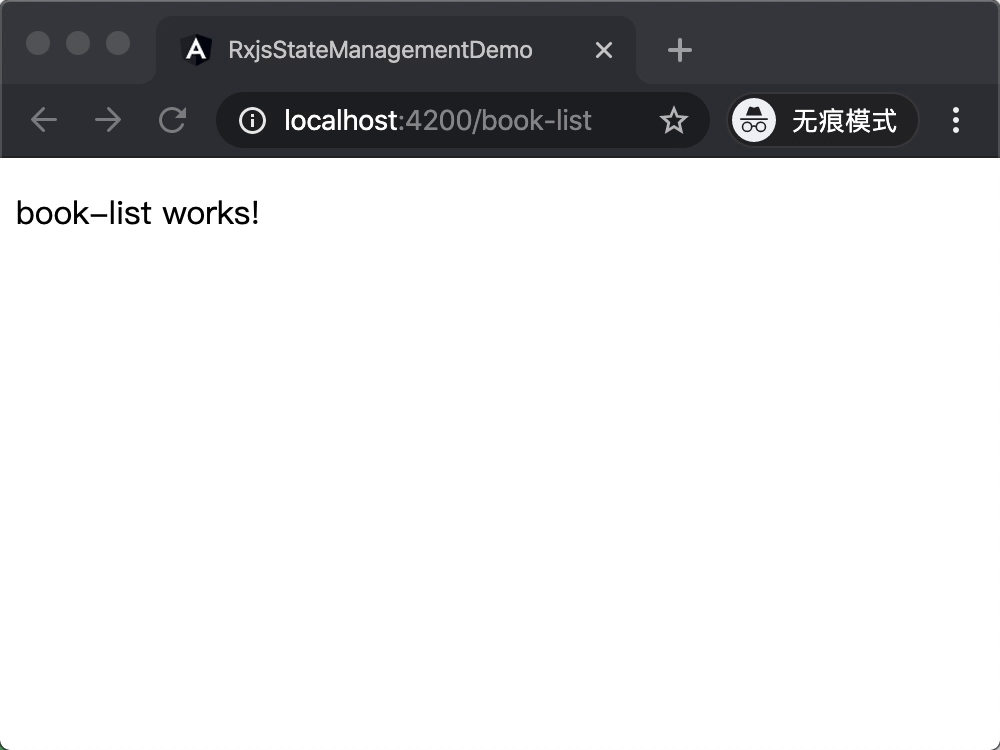
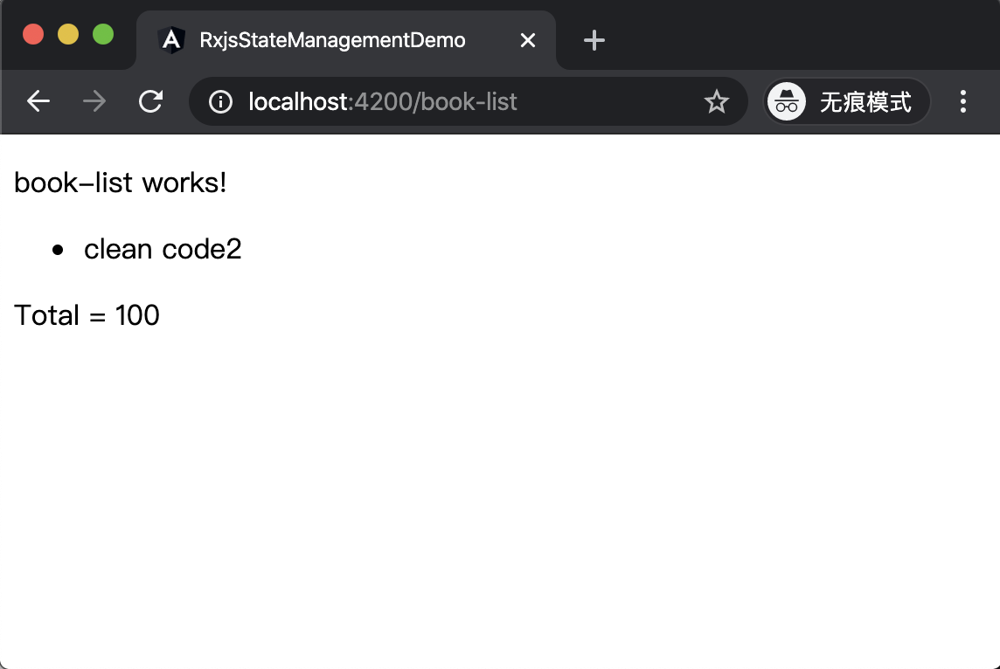
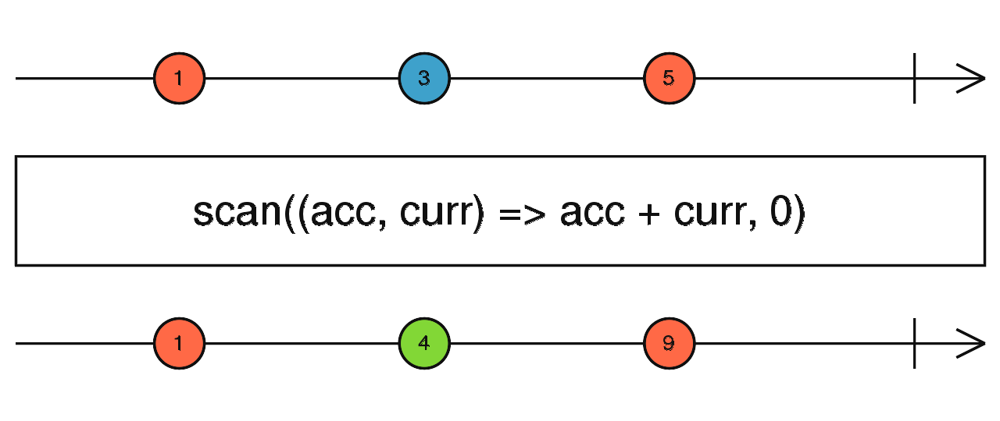
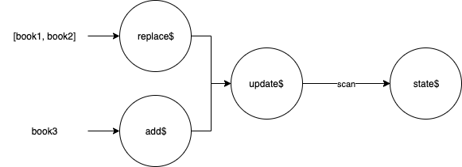

title: Javascrtipt 之 tap 事件封装
date: 2015-08-04 17:26:54

---

## Rxjs 做状态管理

诚然，在前端，状态管理是一个深奥的话题，这同时也是一个见仁见智的问题，随着页面复杂度的提升，对状态管理的理解也会变得不一样。当页面复杂度提高的同时，如果页面上的状态管理设计的不合理，开发会变得越来越痛苦。 现在的前端开发，状态管理，已经成为了至关重要的一部分，如果不是很清楚，可以见我的另一篇文章《我们为什么要做状态管理》。

而怎么去做状态管理，有很多很多的方法，工具和方案都十分多种多样，这里给大家讲一下如何用 Rxjs 做状态管理。

Rxjs 一个 Javascript 响应式编程的工具，采用非阻塞的事件驱动模型，并有流处理的特点，Rxjs 在最近是非常流行。

> 这里不对 Rxjs 做介绍和扫盲，如果读者不了解 Rxjs，建议先阅读其他文章入门。

我们简单假设一个小的业务场景，我们在做一个书籍贩卖的网站。



这个 Demo 有两部分，上面的部分是一个书籍列表，下面的是一个书籍的详情部分，点击书籍后会打开详情页。

## 第一种方案

我们用 Angular + Rxjs 来实现这个小 demo。

Rxjs 能用在任何技术栈，在 Vue 和 React 能运行的很好，但是 Rxjs 还是有一些比较亲和的技术框架，比如 Angular，自带 Rxjs，安装都省去了。

我们先从简单的来，首先我们识别出来的状态肯定需要一个 books 的状态，代表书籍列表。

首先我们需要定义一个放状态的地方，在 angular 技术栈里，service 是一个很方便的载体，我们生成一个 state 的 service

```shell
ng generate service state
```

然后我们在这个 service 定义我们的状态，我们一开始尽量让状态的表现形式简单一些，我们只需要 books 的列表，所以我们定义了一个 `Observable` 叫 `books`，并使用 BehaviorSubject 实现它。

我们在 service 中默认初始化这个可观察对象

```typescript
private books$ = new BehaviorSubject([]);
```

并为这个私有 Observable 用两个方法来访问和改变它

```typescript
public getBooks$(): Observable<IBook> {
  return this.books$;
}
```

`getBooks$` 返回一个 Observable，外界不需要知道 Observable 的实现方式，只需要返回一个 Observable 的接口即可。外部可以通过这个可观察对象来或者 books 的变化。

我们还需要另一个方法来改变 books 的状态：

```typescript
public replaceBooks(books) {
  this.books$.next(books);
}
```

这个方法我们简单设计，要更新新的书籍列表，只需要把新的数据列表发射到 `books$` 中即可。

`BehaviorSubject` 可以保存最后一次可观察对象里面的值，并在订阅的 时候立马返回最后一次的发射值

最后我们的代码如下：

```typescript
import { Injectable } from "@angular/core";
import { BehaviorSubject, Observable } from "rxjs";
@Injectable({
  providedIn: "root"
})
export class StateService {
  private books$ = new BehaviorSubject([]);

  constructor() {}

  public replaceBooks(books) {
    this.books$.next(books);
  }
  public getBooks$(): Observable<IBook> {
    return this.books$;
  }
}
```

接下来我们要实现也页面的功能，我们不打算在这个 demo 中添加交互的功能，我们只需要看到我们数据列表在改变即可。

```shell
ng generate component book-list
```

我们创建一个书籍列表的组建 `book-list`

首先我们要取得 `books$` 这个可观察对象，通过 Angular 的 DI 取得了单例的 `stateService，并赋值到` `component` 上。

```typescript
constructor(public stateService: StateService) {
  this.book$ = stateService.getBooks$();
}
```

在 html 上，我们通过 Angular 的 async 管道把 Observable 订阅在模版上，并渲染书籍列表出来

```html
<div>
  <ul>
    <li *ngFor="let book of book$ | async">
      {{ book.name }}
    </li>
  </ul>
</div>
```

我们把整个代码跑起来试试



可以看到，一开始没有列表渲染出来，只有 book-list works!，在三秒之后渲染出了 clean code 和 refactor 这两本书名，又在两秒后去除了 refactor

完成这样的数据同步，我们在 book-detail 中的代码实际上只有一行

```html
<div *ngIf="book$" n>name: {{ (book$ | async).name }}</div>
```

这样，我们已经完成了最简单的状态管理，如果在别的地方需要对 books 进行修改，我们可以大胆地调用 service 的 api，这里的书籍列表会马上进行同步；或者在别的地方需要用到书籍的数据，也是直接使用接口就可以拿到可观察的数据对象，十分方便。

### 新的需求

假设我们来了一个新的需求，需要在页面中显示所有书本的总价。

当然这样的需求我们直接把 books 拿到之后，再通过 for 循环或者 reduce 方法进行计算，也是可以算出总价，当然，rxjs 有自己的做法，新建一个 total\$ 的可观察对象。

```typescript
this.total$ = this.book$.pipe(
  map(books => books.reduce((acc, cur) => acc + cur.price, 0))
);
```

这个 total$ 由 book$ 经过管道流处理而成，可以直接放到 html 渲染，免去了 subscribe 的麻烦。



这里有一点需要注意的是，这个 `total$` 放在哪里，往往需要结合实际情况进行判断，如果这个业务这个页面中多次被用到，那么放到 service 中是比较好的选择，如果仅仅是在一个地方用到，那么放在使用中的组件也未尝不可。

# 第二种做法 - 单一数据源

熟悉 react 和 redux 的同学应该会很熟悉，“单一数据源”是 Redux 三个核心原则之一。

> 整个应用的 state 被储存在一棵 object tree 中，并且这个 object tree 只存在于唯一一个 store 中。
>
> 这让同构应用开发变得非常容易。来自服务端的 state 可以在无需编写更多代码的情况下被序列化并注入到客户端中。由于是单一的 state tree ，调试也变得非常容易。在开发中，你可以把应用的 state 保存在本地，从而加快开发速度。此外，受益于单一的 state tree ，以前难以实现的如“撤销/重做”这类功能也变得轻而易举。

上面的做法有一个问题，就是数据没有一个很有效的方法去改变它，添加一本书的方法里面需要 subscribe `books$` ，修改后重新发射进去。

```typescript
public addBook(book: any): void {
  this.books$.pipe(take(1)).subscribe(books => {
    this.books$.next(books.concat(book));
  });
}
```

这样的做法，如果以后数据量大了的话，优化起来就比较困难。而且，如果要把 `total` 总价格放进去，实现单一数据源，单一数据树的话，就显得更麻烦了。

所以，我们要做的是，找到一个方法，能方便地修改 Observable 流中的数据。一条流动的 Observable 数据流是无法在外面直接修改里面的值的，那么我们可以换一种思路，我们发射一个方法进去，这个方法的入参是里面值，然后方法进行修改。

举个例子，假设 `state$` 这个 Observable 里面的值是 `{ books: [ book1 ] }`，然后发射一个方法，通过某种方法更新 `state$` 里面的值

```typescript
state => {
  state.books.push(book2);
  return state;
};
```

最后，`state$` 更新一个新的值并发送出去 `{ books: [ book1, book2 ] }`

要实现这样的逻辑需要 Rxjs 的 `scan` 方法：



`scan` 方法相当于平时我们用的 `reduce` 方法，把每一个发射进去做累计计算，并一个一个把结果发射到流中。

看看代码实现，我们新建一个 `State2Service`，准备在组件上替换之前的 service

```typescript
private state$ = new BehaviorSubject({ book: [] });
private update$ = new Subject<Function>();

this.update$
  .pipe(
    scan(
      (state, fn) => {
        return fn(state);
      },
      { book: [] }
    )
  )
  .subscribe(this.state$);
```

首先，定义 `state$` 和 `update$` 两个 Observable，然后在构造函数里实现我们上面说的，我们通过一个辅助的流 `update$` 来实现。`update$` 里面放的是更新方法，然后通过 scan 方法 subscribe 到 `state$` 中去

然后需要一些别的动作，例如 add, replace，来新增书籍和更新书籍数据，就像之前的例子一样。

写法如下：

``` typescript
this.addBook$
  .pipe(
    map((book: IBook) => {
      return (state: any) => {
        state.book.push(book);
        return state;
      };
    })
  )
  .subscribe(this.update$);

this.replace$
  .pipe(
    map((books: any) => {
      return (state: any) => {
        state.book = books;
        return state;
      };
    })
  )
  .subscribe(this.update$);
```
这里我们声明了 `add$` 和 `replace$` 两个可观察对象，然后把这两个 Observable 经过流处理后 `map` 成了一个一个更新方法，发射到 `update$` 中，最后会更新到 `state$` 中去。

最后，我们的 `addBook` 方法只需要把 `book` 参数发射到 `add$` 中即可，流程如下图



最后，我们来看看 `State2Service` 的全部代码

``` typescript
import { Injectable } from "@angular/core";
import { Subject, Observable, BehaviorSubject } from "rxjs";
import { scan, map } from "rxjs/operators";
import { State, IBook } from "./state.interface";

@Injectable({
  providedIn: "root"
})
export class State2Service implements State {
  private state$ = new BehaviorSubject({ book: [] });
  private addBook$ = new Subject<IBook>();
  private update$ = new Subject<Function>();
  private replace$ = new Subject<IBook[]>();

  constructor() {
    this.update$
      .pipe(
        scan(
          (state: any, fn: Function) => {
            return fn(state);
          },
          { book: [] }
        )
      )
      .subscribe(this.state$);

    this.addBook$
      .pipe(
        map((book: IBook) => {
          return (state: any) => {
            state.book.push(book);
            return state;
          };
        })
      )
      .subscribe(this.update$);

    this.replace$
      .pipe(
        map((books: any) => {
          return (state: any) => {
            state.book = books;
            return state;
          };
        })
      )
      .subscribe(this.update$);
  }

  public getBooks$(): Observable<IBook[]> {
    return this.state$.pipe(map((state: any) => state.book));
  }

  public getBookDetail$(bookName): Observable<IBook> {
    return this.getBooks$().pipe(
      map(books => {
        return books.find(book => book.name === bookName);
      })
    );
  }

  public replaceBooks(books: IBook[]): void {
    this.replace$.next(books);
  }

  public addBook(book: IBook): void {
    this.addBook$.next(book);
  }
}
```

`State2Servie` 实现了一个 `State` 的接口，在组件中通过 DI，即可替换之前的 `StateService`，具体代码不在这里展示了，如有兴趣，可以到 Github 上看看代码。

[https://github.com/A-Horse/rxjs-demo](https://github.com/A-Horse/rxjs-demo)

## 更灵活的做法

上面的状态管理其实是一种典型的事件驱动的写法，单纯来看，事件驱动的一个比较大的弊端是通常耦合比较严重。

例如，在 book-list 页面中用到了 `book$` 和 `total$` 这两个可观察对象，在 detail 页面中用到了 `books$` 或者 `bookDetail$` 这两个 Observable，可能在别的地方也需要  引用 `StateService` 来获取 Observable，每一个组件都需要知道  Observable 的存在，可是那些组件明明只需要一些相应的数据而已，这就是强耦合。
