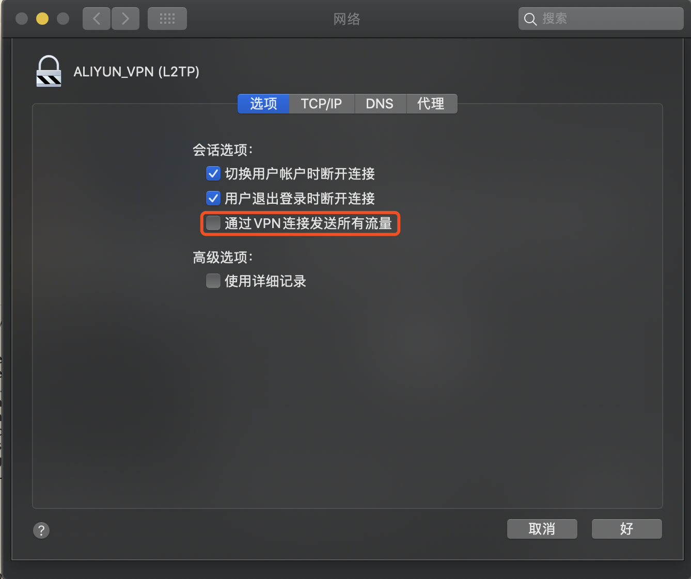

title: Mac配置Vpn路由
date: 2020-02-17 15:51:24
---

# Mac配置Vpn路由

总所周知，VPN很重要，我们在 Mac 中连上 VPN 后，很多情况下我们不希望所有流量都经过 VPN，原因可能有很多个，一是可能 VPN 服务的流量带宽不够了，或者所有流量都走 VPN 后，一些国内的流量会比较慢。

所以，要实现这样的需求，可以设置如何配置指定的 ip 路由走 VPN，其他则不走，也就是静态路由。

首先，这里不赘述如何在 Mac 设置 VPN，不过，得把 VPN 网络高级设置中的“通过VPN连接发送所有流量“的勾选框给取消勾选掉。

> 这个选项默认是打开的，如果勾选上，这台机器就会把 VPN 隧道当成网关，如果没勾选掉，则需要VPN服务器连上之后推送相关的路由信息过来，程序则会自动设置好这些路由，需要走 VPN 的才会走 VPN。当然大部分情况下，VPN服务器并不具备这样的功能，所有我们需要单独设置。

> 题外话，如果你需要一些特殊的网站列表，可以搜搜这个玩意“chnroutes”，是一个完整的列表 



# 设置静态路由
我们可以通过下面的命令来设置一条静态路由，假设我们需要针对 `172.1.1.1` 这个 IP 通过 VPN，我们的 VPN 接口名为 `ppp0` 则命令如下

``` bash
sudo /sbin/route add 172.1.1.1/32 -interface ppp0
```

> `ppp0` 接口名可以通过 `ifconfig` 命令获得

这里可以顺便讲一下 CIDR 掩码，IP 地址用标准的带有CIDR掩码长度的点分十进制声明。 掩码长度表示客户端 IP 地址必须匹配的高位二进制位数。

典型的这种方式指定的IP地址范围举例：

172.20.143.89/32表示一个主机， 

172.20.143.0/24表示一个小子网（172.20.143.0-172.20.143.255）

10.6.0.0/16 表示一个大子网(10.6.0.0-10.6.255.255)。

0.0.0.0/0代表所有IPv4地址，

::/0代表所有IPv6地址。

通过上面的命令，我们已经设置好一条静态路由了，我们的需求已经达到了，只有 `172.1.1.1` 这 ip 会走 VPN，其他的网络请求还是走原来的网关。

# 自动一点
当然，如果每次都需要手动去执行命令一遍，显得有点傻，我们可以通过脚本自动启动。

因为我用的是 `L2TP/IPSec` 的 VPN，所以我们可以直接在 `/etc/ppp` 中新建一个文件叫 `ip-up`

``` bash
sudo vim /etc/ppp/ip-up
```
写入刚才的命令

```
#!/bin/sh
/sbin/route add 172.1.1.1/32 -interface ppp0
```

这样，每次连接 VPN 的时候就会自动执行这个命令来设置静态路由了。

如果你希望在断开 VPN 的同时，自动把静态路由删除，可以在 `/etc/ppp/ip-down`中删除

> 大多数情况下，只要 ip 不冲突，端口连接不删除也不影响

``` bash
sudo route -n delete 172.1.1.1/32 -link ppp0
```

> 如果按照这样的配置还是无法实现静态路由，或者有其他网络问题，可以检查一下 DNS 是否配置正确，可以试试手动将 VPN 的 DNS 设置成原有网络的（wifi 或者以太网环境）

# 参考文章
[https://wiki.archlinux.org/index.php/Ppp](https://wiki.archlinux.org/index.php/Ppp)

[https://www.tldp.org/HOWTO/PPP-HOWTO/](https://www.tldp.org/HOWTO/PPP-HOWTO/)

[Layer_2_Tunneling_Protocol](https://en.wikipedia.org/wiki/Layer_2_Tunneling_Protocol)

---