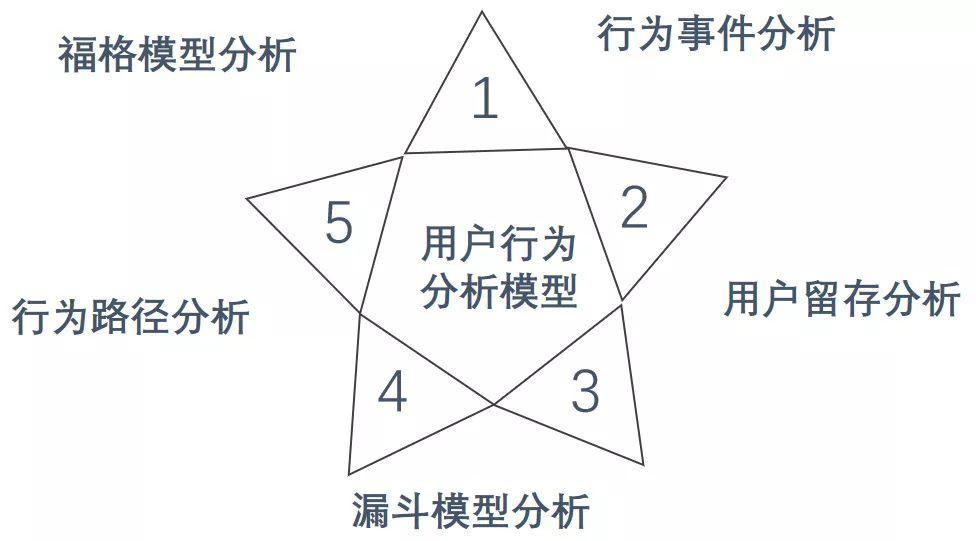

# 用户行为分析

## 什么是用户行为分析
用户行为分析是对用户在产品上的产生的行为及行为背后的数据进行分析，通过构建用户行为模型和用户画像，来改变产品决策，实现精细化运营，指导业务增长。

在产品运营过程中，对用户行为的数据进行收集、存储、跟踪、分析与应用等，可以找到实现用户自增长的病毒因素、群体特征与目标用户。从而深度还原用户使用场景、操作规律、访问路径及行为特点等。

## 为什么要做用户行为分析
对于互联网金融、新零售、供应链、在线教育、银行、证券等行业的产品而言，以数据为驱动的用户行为分析尤为重要。用户行为分析的目的是：推动产品迭代、实现精准营销，提供定制服务，驱动产品决策。主要体现在以下几个方面：

对产品而言，帮助验证产品的可行性，研究产品决策，清楚地了解用户的行为习惯，并找出产品的缺陷，以便需求的迭代与优化。
对设计而言，帮助增加体验的友好性，匹配用户情感，细腻地贴合用户的个性服务，并发现交互的不足，以便设计的完善与改进。
对运营而言，帮助裂变增长的有效性，实现精准营销，全面地挖掘用户的使用场景，并分析运营的问题，以便决策的转变与调整。

# 数据采集
1. 数据埋点
2. 问卷调查
3. 访谈观察

## 数据埋点
1. 埋点
2. 无埋点
3. 可视化埋点
4. 其他

### 埋点 (Event Tracking)

### 无埋点 (Codeless Tracking)

### 可视化埋点

## 埋点和日志

# 用户行为分析模型

## 漏斗模型分析

## 行为路径分析
行为路径分析就是分析用户在产品使用过程中的访问路径。通过对行为路径的数据分析，可以发现用户最常用的功能和使用路径。并从页面的多维度分析，追踪用户转化路径，提升产品用户体验。

不管是产品冷启动，还是日常活动营销，做行为路径分析首先要梳理用户行为轨迹。用户行为轨迹包括认知、熟悉、试用、使用到忠诚等。轨迹背后反映的是用户特征，这些特征对产品运营有重要的参考价值。

以用户投标的行为路径为例，我们可以记录用户从注册、认证、开户、充值到投资的行为轨迹。通过分析用户的这些行为轨迹数据，来验证访问路径是否和预期指标的一致。

## 用户留存分析模型
留存分析是一种用来分析用户参与情况/活跃程度的分析模型，考察进行初始行为的用户中，有多少人会进行后续行为。这是用来衡量产品对用户价值高低的重要方法。

留存分析可以帮助回答以下问题：

一个新客户在未来的一段时间内是否完成了您期许用户完成的行为？如支付订单等；
某个社交产品改进了新注册用户的引导流程，期待改善用户注册后的参与程度，如何验证？
想判断某项产品改动是否奏效，如新增了一个邀请好友的功能，观察是否有人因新增功能而多使用产品几个月？
二、为什么要做留存分析，直接看活跃用户百分比不行吗？
对此疑惑，答案显然是，当然不行！

如果产品目前处于快速增长阶段，很有可能新用户中的活跃用户数增长掩盖了老用户活跃度的变化。按初始行为时间分组的留存分析可以消除用户增长对用户参与数据带来的影响。通过留存分析，你可以将用户按照注册时间分段查看，得出类似如下结论：

“三月份改版前，该月注册的用户 7 天留存只有 15%；但是四月份改版后，该月注册的用户 7 天留存提高到了 20%。”

# 数据指标体系

## OSM 模型

https://www.cnblogs.com/HuZihu/p/11446571.html

Google Analytics

https://my.oschina.net/u/3721535/blog/1612630?utm_source=debugrun&utm_medium=referral

https://www.jianshu.com/p/a0ea0df0eedb

https://blog.csdn.net/c_air_c/article/details/100095970

http://www.woshipm.com/user-research/3236774.html

http://www.mysecretrainbow.com/report/12611.html

https://www.jianshu.com/p/225f220b976f