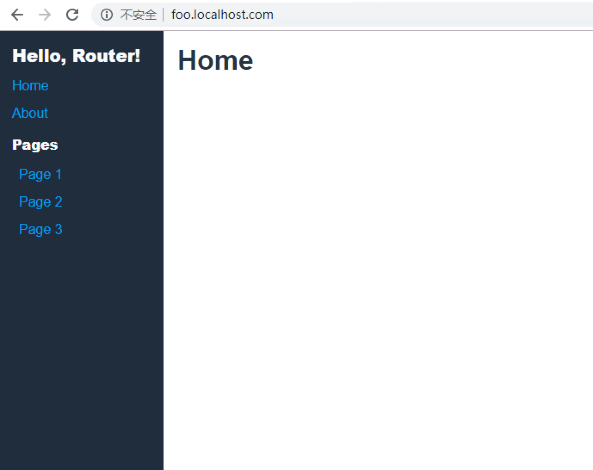

title: Nginx使用攻略（一）之部署前端应用
date: 2020-02-22 12:16:07
---

Nginx 是由俄罗斯人 Igor Sysoev 设计开发的一款免费开源的高性能 HTTP 代理服务器及反向代理服务器（Reverse Proxy）产品。发音发作 "engine x"。现在 NGINX 也有商业版本 NGINX PLUS，有高级负载均衡，JWT 解析等功能，其他基本和开源版本一致，这篇文章也是基于 NGINX 开源版本来构建例子。

现在的 web 应用，有很大一部分单页面应用是通过 Nginx 来部署的，这种部署让应用的前后端分离，更为灵活，这篇文章来讲讲如何用 Nginx 部署流行的前端应用。

## NGINX 部署静态页面

我们先用来部署一个简单的静态应用进行示范，我们用 [react-router-example](https://github.com/alanbsmith/react-router-example) 生成的 demo 作为本文的示范站点，这是一个有路由的单页面网站。

假设已经构建出来了一个 dist 的文件夹，我们要将它移动到 nginx 的默认目录下：

> 当然，你也可以移动到别的地方，甚至不移动。


```bash
sudo cp -r dist /var/www/foo
```

然后我们更改这个目录的 linux 用户所有者，以保证安全性。

```bash
sudo chown www-data:www-data /var/www/foo
```

 我们现在可以创建一个 nginx 的配置文件了，Nginx 可以很方便地配置多站点，我们假定绑定一个 foo.localhost.com 的域名给我们的服务器，那么我们新建一个路径为 `/etc/nginx/site-enabled/foo.conf` 的配置文件。

`site-enabled/foo.conf`
``` nginx
server {
    listen 80;
    server_name foo.localhost.com;

    root /var/www/foo;
    index index.html;
}
```
这应该是最为简单的一个配置。

我们 reload 一下 nginx 的配置。

```bash
nginx -s reload
```

这样，我们的 web 应用就部署好了，这个 Nginx 是部署在我一台 ip 为 `192.168.50.191` 的 Linux 虚拟机上的，我们需要绑定一下 `foo.localhost.com` 这个域名。

一般选择修改本机的 hosts 文件来绑定。

> 这里多说一嘴，如果是部署在互联网的应用，应该要在域名供应商上添加解析。

绑定成功后，就会通过 foo.localhost.com 访问到我们的页面。




### 处理单页面应用
<br/>
当然，这样的配置还有一个很大的问题，当你路由到 `http://foo.localhost.com/pages/1` 这个页面再刷新，或者直接进入到这个 url ，页面就 404 了。


这是因为现在的单页面应用普遍试用了 HTML5 的 [History API](https://developer.mozilla.org/en-US/docs/Web/API/History_API)，不久之前的 SPA （单页面应用）是用 Url 的 Hash 部分来实现的(井号)，在 HTML5 的 history api 出来后，监禁增强的 history api 便代替了 Hash 的使用，这意味着网站的 URL 从之前的 `foo.localhost.com/#page1` 变成了 `foo.localhost.com/page1`，`foo.localhost/page2`，这要求我们的页面访问这些页面都要返回同一份 HTML，也就是我们的单页面应用。

要完成这样的需求，Nginx 需要的配置也很简单，只需要把

``` nginx
index index.html;
```
换成
``` nginx
try_files $uri $uri/index.html /index.html;
```
即可（其实两行配置同时留着也可以）

```nginx
server {
    listen 80;
    server_name foo.localhost.com;

    root /var/www/foo;
    try_files $uri /index.html;
}
```


try_files 这个指令会让 nginx 按顺序查找文件，$uri 这个 URI 找不到的时候，就会返回 /index.html， 而 /index.html 是我们打包后的 应用 HTML 文件。
